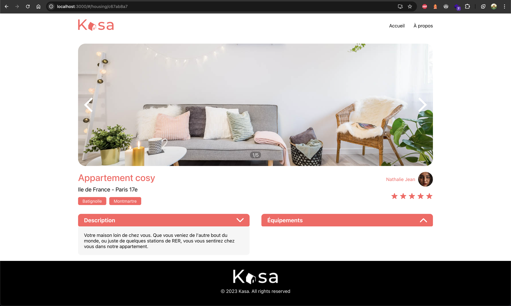
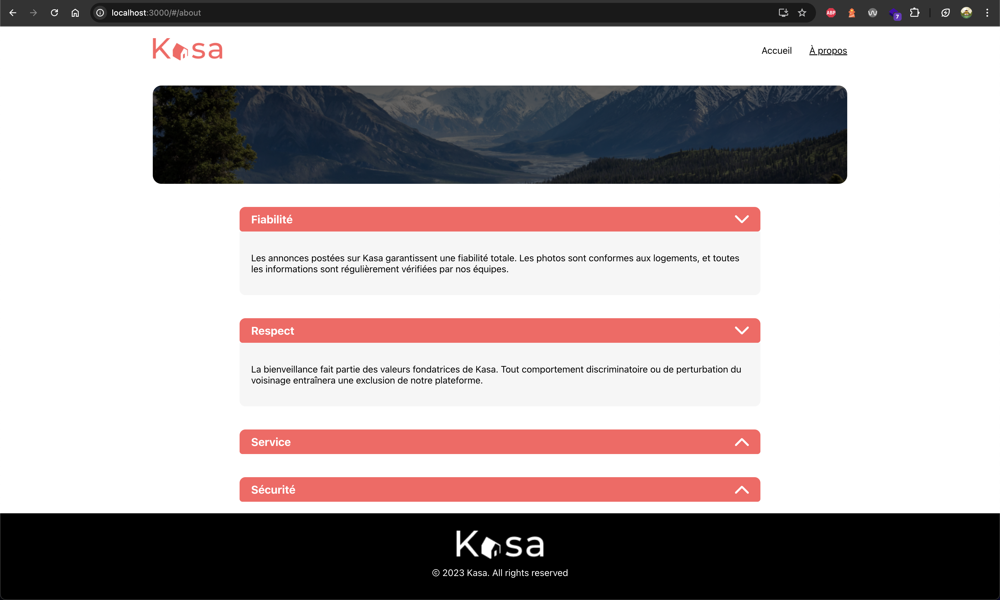
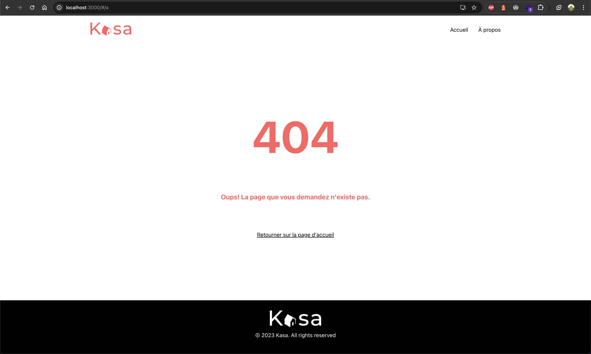

# Kasa - Projet 5 (OpenClassrooms)

Ce projet est une application d’agence immobilière construite en React, dans le cadre de la formation Développeur Web JavaScript/React. Elle permet de visualiser une liste de logements, leur détail (carrousel d’images, rating, etc.), une page À propos, et une page d’erreur 404 pour toute route inexistante.

## Sommaire

1. [Fonctionnalités](#fonctionnalités)
2. [Installation](#installation)
3. [Utilisation](#utilisation)
4. [Aperçu / Screenshots](#aperçu--screenshots)
5. [Technologies](#technologies)
6. [Architecture](#architecture)
7. [Crédits](#crédits)

## Fonctionnalités

- **Accueil** : affiche la liste des logements avec un aperçu (image, titre).
- **Page Logement** : détail d’un logement (carrousel d’images, infos du propriétaire, rating, tags, description, équipements, etc.).
- **Page À propos** : plusieurs sections repliables (collapses) décrivant la philosophie de Kasa (Fiabilité, Respect, Service, Sécurité).
- **Page 404** : s’affiche en cas de route inexistante ou d’ID non trouvé.
- **Responsivité** : le site s’adapte aux écrans desktop et mobile.

## Installation

1. Cloner ce dépôt :

   git clone https://github.com/Mike-Spit/Projet5.git

2. Se rendre dans le dossier du projet :

   cd Projet5

3. Installer les dépendances :

   npm install

4. Lancer l’application :

   npm start

L’application se lancera à l’adresse http://localhost:3000

## Utilisation

- **Accueil (Home)** : liste des logements avec un visuel.
- **Logement** : en cliquant sur un logement, vous accédez à la page “Housing” avec toutes les infos détaillées.
- **À propos (About)** : texte repliable (collapses) décrivant divers aspects de Kasa.
- **404** : toute route non définie renvoie vers la page d’erreur.

Pour modifier les données (logements, etc.), éditez le fichier logements.json (public/logements.json).

## Aperçu / Screenshots

1. **Accueil**  
   

2. **Détail d’un logement**  
   

3. **Page À propos**  
   

4. **404**  
   

## Technologies

- React (Create React App)
- React Router
- Sass (SCSS)
- Node.js / npm pour la gestion des dépendances

## Architecture

Ci-dessous, un aperçu de l’arborescence :

    Projet5/
    ├── public/
    │   ├── logements.json
    │   └── ...
    ├── src/
    │   ├── assets/
    │   │   └── images/ (bannières, flèches, etc.)
    │   ├── components/
    │   │   └── common/ (Collapse, Slideshow, Banner, etc.)
    │   ├── pages/
    │   │   ├── Home.jsx
    │   │   ├── About.jsx
    │   │   ├── Housing.jsx
    │   │   └── Error404.jsx
    │   ├── styles/
    │   │   ├── variables.scss
    │   │   ├── Home.scss
    │   │   ├── About.scss
    │   │   ├── Housing.scss
    │   │   ├── Error404.scss
    │   │   └── ...
    │   ├── App.js
    │   ├── index.js
    │   └── ...
    └── package.json

## Crédits

- Formation : OpenClassrooms — Parcours Développeur Web JavaScript/React
- Design : Maquette Kasa (fournie par OC)
- Auteur : [Mike-Spit](https://github.com/Mike-Spit)

**Merci d’utiliser l’application Kasa !** N’hésitez pas à créer une issue ou un pull request si vous constatez un bug ou souhaitez proposer une amélioration.
